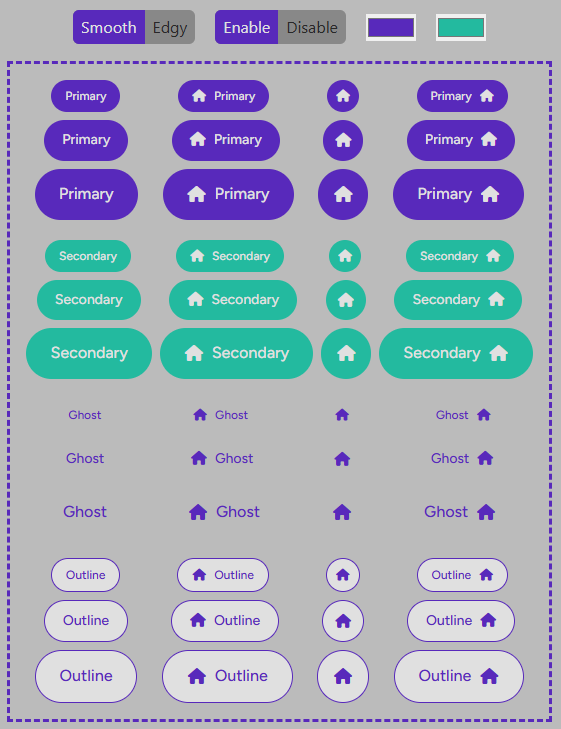

# Button Component

A customizable button component built with React and TypeScript. It supports various styles, sizes, and icon positions.

[functional page here](https://free-responsive-button-ui-kit-react.netlify.app).

This project is based on a design from Figma available in the community. Thanks to the author [@pinarr](https://www.figma.com/@pinarr) for the inspiration. You can check out the design [here](https://www.figma.com/community/file/1169572872932409282).



## Props
| Prop  | Type | Default | Description 
| :-------------: |:-------------:|:-------------:|:-------------|
| children | `React.ReactNode`    | `undefined` | The content inside the button, such as text or other elements. |
| corners | `smooth` &#124; `edgy`    | `smooth` | Determines the border-radius of the button (smooth for rounded, edgy for sharp). |
| size | `small` &#124; `medium` &#124; `large`    | `medium` | Specifies the size of the button. |
| styleType |  `primary` &#124; `secondary` &#124; `outline` &#124; `ghost`    | `primary` | Defines the button's style variant. |
| icon* | `React.ReactNode`    | `undefined` | An optional icon to display within the button. |
| iconPosition* | `left` &#124; `right` &#124; `only` &#124; `none`    | `undefined` | Position of the icon relative to the button content. |
| disabled | `boolena` | `false` | Disables the button if set to true. |


## Usage
Here's how to use the button with different configurations:

### Basic Example:
```
<Button>
  Click Me
</Button>
```

### Button with Icon:
```
<Button icon={<SomeIcon />} iconPosition="left">
  Save
</Button>
```
### Different Styles:
```
<Button styleType="primary">Primary</Button>
<Button styleType="secondary">Secondary</Button>
<Button styleType="outline">Outline</Button>
<Button styleType="ghost">Ghost</Button>
```
### Button Sizes:
```
<Button size="small">Small</Button>
<Button size="medium">Medium</Button>
<Button size="large">Large</Button>
```

### Disabled Button:
```
<Button disabled>Disabled</Button>
```

## Event Handlers
The component supports common button event handlers such as `onClick`, `onMouseDown`, and `onKeyUp`. You can pass these events directly as props.

```
<Button onClick={() => alert('Button clicked!')}>
  Click Me
</Button>
```

## License
This component is open-source and available under the MIT License.